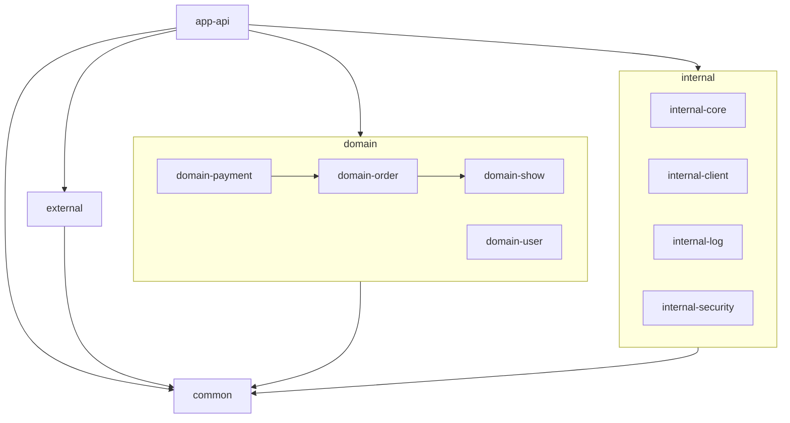
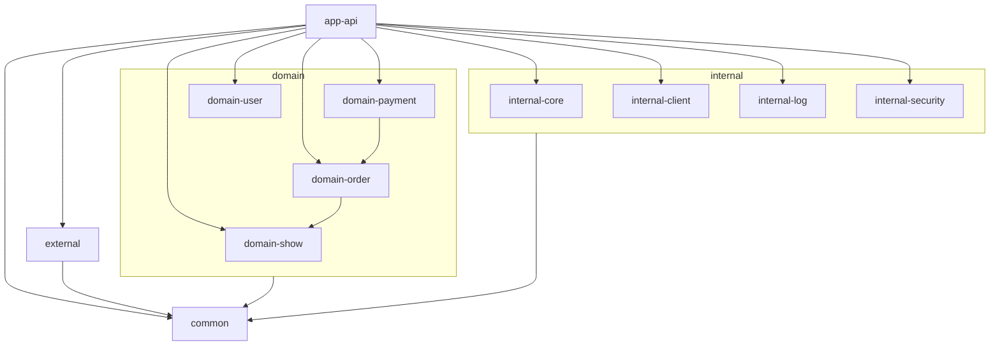

## 2025.05.22 - internal 모듈도 하위 모듈 존재
생각해보니 internal 모듈도 하위 모듈이 존재할 법 하다.
 
security라던지 log, redis-client 등등...
 
그래서 필요에 따라 외부 모듈을 가져올 수 있는 형태로 해야할 것 같다.
 
뿐만 아니라 domain 모듈도 잘못 생각 했던거 같다.
 
부모 모듈을 의존 받는다고 해서 자식 모듈 모두를 사용한다...? 마치 interface를 사용하는데 모든 구현체를 사용 가능한거랑 같은거 아닌가?
 
그래서 domain을 의존하는 형태를 바꿔야 할거 같다.
 
현재가 아래와 같다면
 

 
이제는 이런식이 되어야겠지
 

