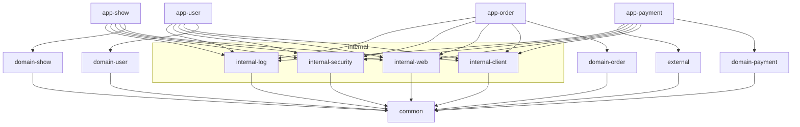

## 2025.05.25 - 마인드 갈아엎기
오늘 모각코를 나갔다가 배달의 민족 5년차 개발자분을 만났다. 결제 도메인에서 일하시는거 같고 많은 조언을 들었다.
 
그중 프로젝트와 관련된 조언을 받았는데 모듈 설계가 잘못된거같다...
 
모듈 설계의 방향성, 특히 도메인 모듈이 너무 커서 하나의 모듈에 너무 많은 도메인이 들어가 있다.
 
근데 따지자면 도메인 모듈은 각각이 거의 하나의 MS에 상응해야할 개념인데, 지금은 단일 애플리케이션을 상정한 모듈화에 그치지 않냐는 의견이셨다.
 
그렇기에 도메인, 개념을 기준으로 모듈을 나누자는 얘기다.
 
다만, 도메인 모듈에서 공통되는 부분을 core 모듈로 분리하고, 이것을 선택적으로 사용할 수는 있지만 결과적으로는 각 도메인 모듈이 거대한 도메인이라는 모듈의 하위모듈이 된다기보다는 각각의 독립적인 모듈로써 존재해야 한다는 얘기였다.
 
그렇기에 모듈을 설계할 때는 각 도메인 모듈이 독립적인 마이크로서비스로써 존재할 수 있도록 설계해야 모듈로써 의미를 가질 수있다고 하시는거 같다.
 
그럼 이제 뭘 어카지..

 

### 개념 모듈을 상위로 옮기기

개념 모듈을 상위로 옮기고, 공통되는 부분은 core 모듈로 분리하는 방향으로 가야할 것 같다.
 
지금 당장은 단일 프로젝트에 단일 데이터베이스를 기준으로 설계를 하다 보니 뭔가 공통되게 사용할 것 같이 모듈 설계가 되어있지만 결국은 각 도메인 모듈이 독립적인 마이크로서비스로써 존재할 수 있도록 설계해야 한다.
 
이게 무슨 말이냐면, show 모듈이 MySQL을 사용하고 payment 모듈은 DynamoDB를 사용한다고 하면 이걸 동일한 JPA Repository로 묶어버리면 안된다는 얘기다.
 
조금 더 추상적이고 개념단위로, 도메인이라는 영역이 특정 방식에 종속되지는 않아야 한다고 느껴진다.
 

### 도메인 객체의 추상화
뭔가 설계를 하다보니 entity와 도메인 객체(개념적 객체)를 분리하는 이유를 알거같다.
 
도메인 객체는 개념적으로 도메인을 표현하는 객체이고, entity는 결국 영속화를 위한 객체로 따지자면 도메인 객체의 구현체?(물론 이것이 객체지향의 추상화와는 얼핏 다를 수 있겠다만)라는 느낌...
 
변경된 모듈 의존성은 아래와 같다.
 

