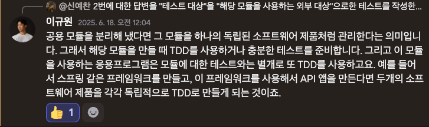

## 2025.06.20 - 탄력받은 TDD

지난 기능 구현에 TDD를 적용해봤고, 이과정에서 명확한 시나리오만 있다면 빠르고 안정적으로 요구사항을 충족하는 코드를 만들 수 있다는 것을 느꼈다.

다만 좀 아쉬운건 하위 모듈에 대한 TDD가 제대로 이루어지지 않았다는 것이다.

한가지 생각은, 리팩토링 과정에서 코드가 하위모듈로 넘어갈때 TDD를 하는것이 어떤가 하는 의견이다.

어찌되었든 모듈화는 독립된 컴포넌트를 만드는 작업이다 보니 하위모듈을 설계한다는건 해당 모듈을 주입받는 상위 모듈을 하나의 클라이언트로 인식하고 이에 대한 테스트가 필요하다는 것이다.

